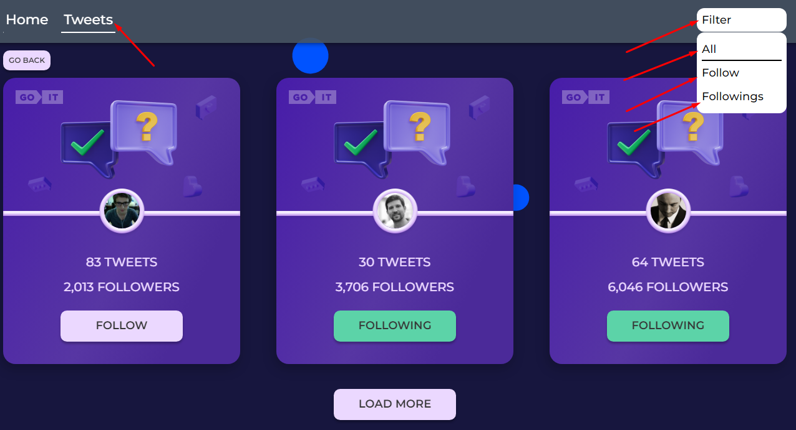
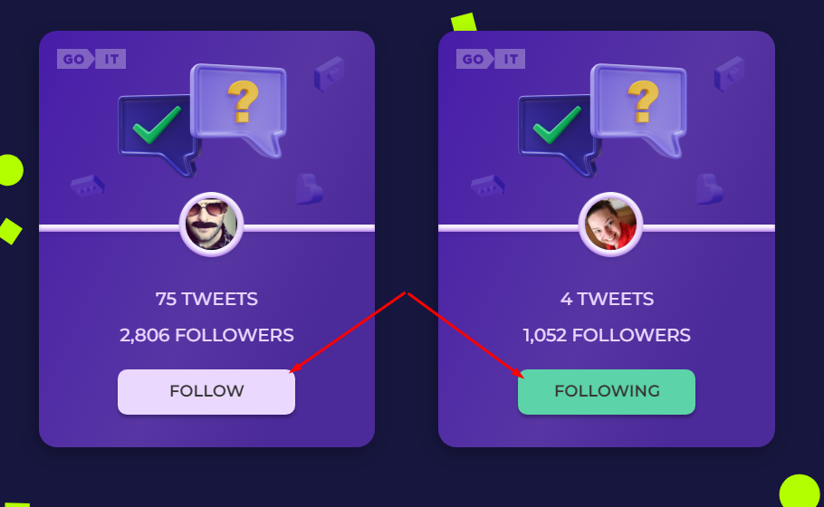

# FollowersConnect Website

This project was created with
[React homework template](https://github.com/goitacademy/react-homework-template#readme).

## Short roadmap

The website consists of two pages: the Home page and the Tweets page. They can
be switched with a mouse click.

On the Tweets page you can filter users by followings using the dropdown located
in the header.

On the Tweets page you can use the `«GO BACK»` button to navigate you to the
Home page.

On the bottom of the Tweets page you can load next users by clicking
`«LOAD MORE»` button.

The website will also provide an opportunity to select users you would like to
follow using the `«FOLLOW»` button and unfollow, if you are already subscribed,
using the `«FOLLOWing»` button.

## Contribution

Contributions to this project are welcome! If you find any issues or have ideas
for improvements, please open an issue or submit a pull request.

When contributing, make sure to follow the existing code style and guidelines.
Provide detailed information about your changes and test them thoroughly before
submitting a pull request.
